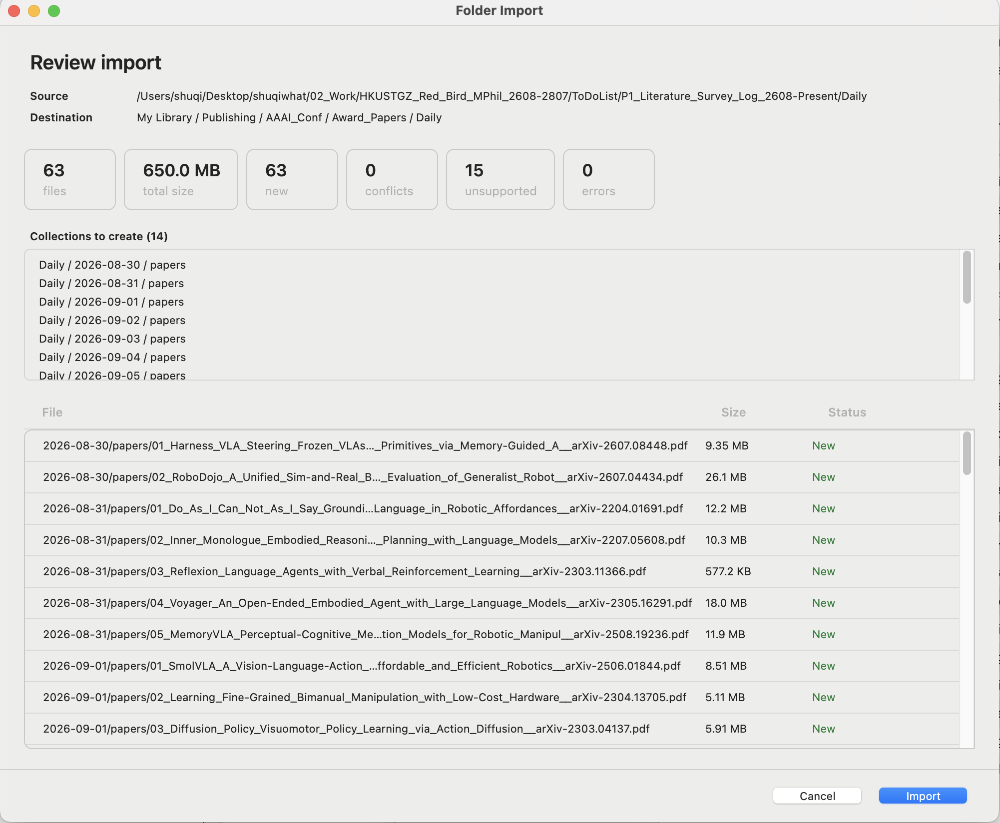
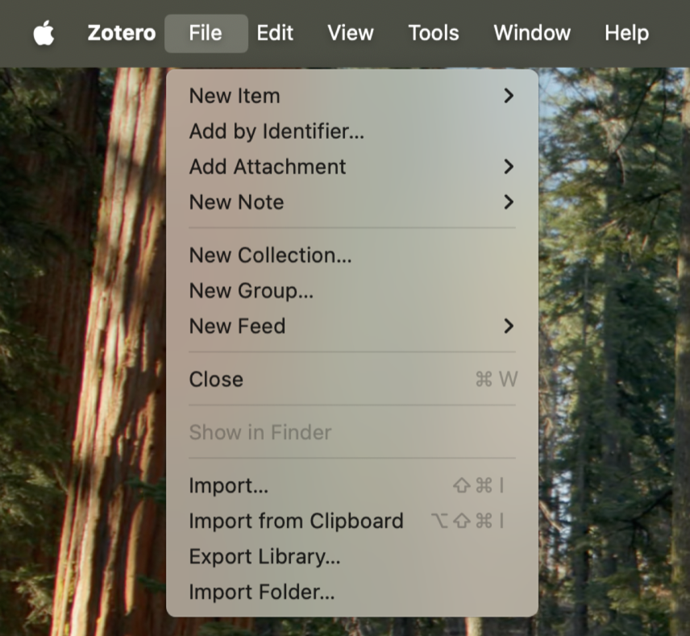
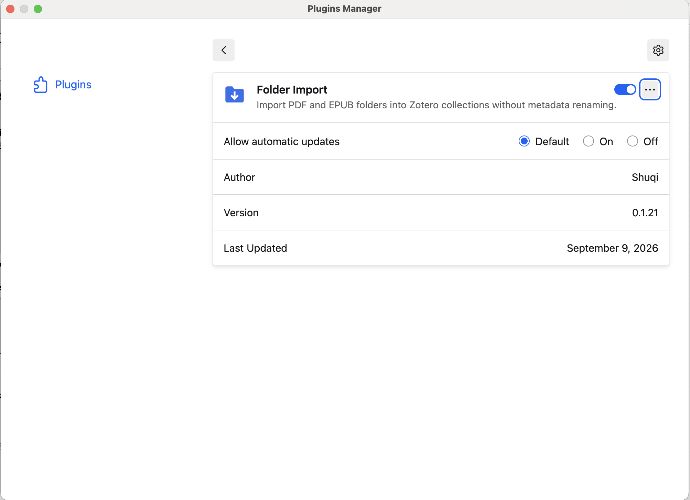
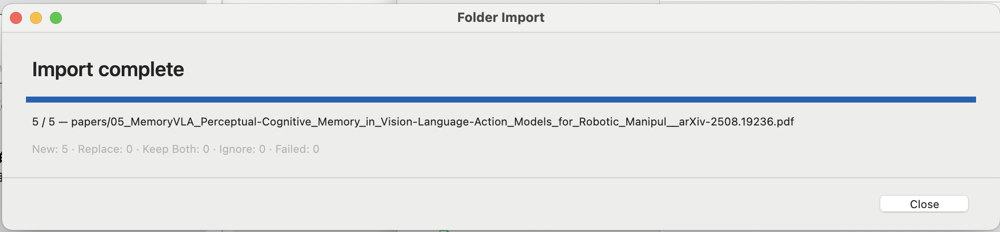

<div align="center">

# Zotero Folder Import

[English](README.md) · [简体中文](README.zh-CN.md) · [日本語](README.ja.md) · [한국어](README.ko.md)


</div>

長年フォルダで整理してきた PDF がハードディスクいっぱいにある。けれど Zotero は一つずつしか受け取ってくれません。

Zotero Folder Import はフォルダツリーをまるごと取り込みます。フォルダ構造はそのまま入れ子のコレクションになり、ファイル名も元のまま。リネームもせず、オンラインでメタデータを探しにもいきません。Finder で見えているものが、そのまま Zotero に入ります。

何かが書き込まれる前に、まず確認画面が表示されます。件数、作成されるコレクション、そして一つひとつのファイルの状態。決めるのはあなたです。

## Folder Import を選ぶ理由

- 📁 **フォルダ構造をそのまま**：ディレクトリツリーが入れ子のコレクションになり、ファイル名も保持されます。メタデータ検索なし、リネームなし。
- 👀 **動かす前に見える**：確認ダイアログに合計件数、作成予定のコレクション、ファイルごとの状態が表示されます。1 ファイルも動かす前に。
- 🤝 **競合はあなたが決める**：ファイルごとに Replace（置き換え）／Keep Both（両方残す）／Ignore（無視）を選べます。Replace は新しいファイルを先に取り込み、それが成功してから古いほうをゴミ箱へ移します。
- ⏹️ **いつでも中断できる**：取り込み途中でキャンセルしても、すでに取り込まれた分はそのまま残ります。
- 🧩 **コピーは互いに独立**：各取り込みが独立した添付ファイルなので、あるコレクションでの削除や注釈が別のコレクションに影響することはありません。
- 🔒 **設計からプライベート**：ネットワーク通信なし、テレメトリなし、メタデータ検索なし。ファイルの内容を読むこともハッシュ化することもありません。照合は取り込み先コレクション内のファイル名だけで行われます。

## スクリーンショット

<div align="center">
  
</div>

<br/>

<table>
	<tr>
		<td align="center"><strong>ファイルメニューの Import Folder…</strong></td>
		<td align="center"><strong>プラグインマネージャーでの表示</strong></td>
	</tr>
	<tr>
		<td align="center"></td>
		<td align="center"></td>
	</tr>
	<tr>
		<td align="center" colspan="2"><strong>取り込み完了</strong></td>
	</tr>
	<tr>
		<td align="center" colspan="2"></td>
	</tr>
</table>

## インストール

[リリースページ](https://github.com/howtoexitvim/zotero-folder-import/releases) から `.xpi` をダウンロードします。現在のリリースは **v0.1.21** です。

Zotero で **ツール → アドオン → 歯車アイコン → ファイルからアドオンをインストール…** を開き、ダウンロードしたファイルを選択します。再起動を求められたら再起動してください。

あとは **ファイル → Import Folder…** を選ぶか、任意のコレクションを右クリックします。

Zotero 10 が必要です。

## ソースからビルド

```bash
npm install
npm test
npm run build
```

`npm run build` は `dist/folder-import-<version>.xpi` を生成します。

## 補足

自動更新チャンネルはありません。新しいバージョンも、最初と同じ手順でインストールします。

## License

[MIT](LICENSE)
